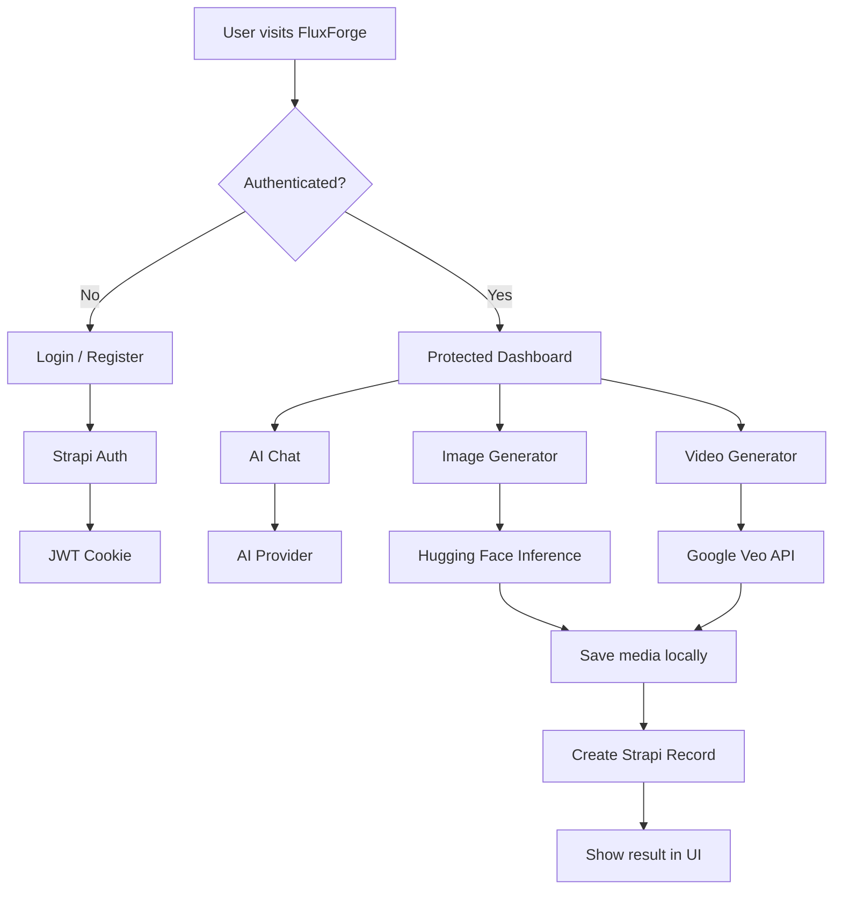

<!--
  FluxForge README
  Safe note: this README intentionally contains no real API keys, tokens, .env values, or deployment secrets.
-->

<div align="center">


<br />


<br />
<br />

<a href="https://github.com/UjjwalKumarKannojiya/Ai-SaaS/stargazers"></a>
<a href="https://github.com/UjjwalKumarKannojiya/Ai-SaaS/network/members"></a>
<a href="https://github.com/UjjwalKumarKannojiya/Ai-SaaS"></a>
<a href="https://github.com/UjjwalKumarKannojiya/Ai-SaaS/commits/main"></a>

<br />
<br />

<b>FluxForge</b> is a modern AI-SaaS application with a premium Next.js frontend, Strapi CMS backend, secure authentication, AI image generation, AI chat workflow, and billing-aware video generation flow.

</div>

---

## ✨ Project Highlights

<table>
  <tr>
    <td><b>🚀 Full-Stack SaaS</b></td>
    <td>Next.js frontend + Strapi backend with clean separation of concerns.</td>
  </tr>
  <tr>
    <td><b>🤖 AI Features</b></td>
    <td>AI chat, Hugging Face image generation, and Google Veo video route support.</td>
  </tr>
  <tr>
    <td><b>🔐 Secure Auth</b></td>
    <td>JWT-based auth flow with protected dashboard pages and Strapi user integration.</td>
  </tr>
  <tr>
    <td><b>🎨 Premium UI</b></td>
    <td>shadcn/ui, Tailwind CSS v4, theme support, animated AI elements, and responsive layouts.</td>
  </tr>
  <tr>
    <td><b>🧠 CMS Powered</b></td>
    <td>Strapi content types for conversations, messages, images, videos, and users.</td>
  </tr>
  <tr>
    <td><b>🛡️ Secret Safe</b></td>
    <td>Environment files are ignored and never committed. Only safe example files are tracked.</td>
  </tr>
</table>

---

## 🧩 Tech Stack

<div align="center">


<br />


</div>

---

## 🏗️ Repository Structure

```txt
Ai-SaaS/
├── frontend/          # Next.js 16 + React 19 AI SaaS frontend
├── strapi-ai-saas/    # Strapi 5 backend for auth, images, videos, chat data
├── ClipForge/         # Preserved Strapi scaffold / experimental setup
├── SETUP_NOTES.md     # Local setup reference
├── .gitignore         # Secure ignore rules
└── README.md          # Project documentation
```

---

## ⚙️ Core Modules

### 1. Frontend — `frontend/`

- Next.js App Router
- Protected dashboard
- Login and register pages
- AI chat route
- AI image generation route
- AI video generation route
- shadcn/ui + custom AI elements
- Theme provider and premium UI components

### 2. Backend — `strapi-ai-saas/`

- Strapi 5 CMS backend
- Users & Permissions plugin
- Custom content types:
  - `conversation`
  - `message`
  - `image`
  - `video`
- JWT authentication support
- Production-ready backend structure

### 3. AI Services

| Feature | Provider | Status |
|---|---|---|
| AI Chat | Google AI SDK | Ready for API key |
| Image Generation | Hugging Face Inference Providers | Working with correct HF token permission |
| Video Generation | Google Veo | Requires Google Cloud billing |

> ⚠️ Google Veo video generation uses `veo-2.0-generate-001`, which requires Google Cloud billing. The route is billing-aware and should return a clean billing message instead of crashing.

---

## 🔐 Environment Variables

Never commit real `.env` files. Add values only locally or inside hosting dashboards such as Vercel, Render, Railway, or Strapi Cloud.

### Frontend — `frontend/.env`

```env
NEXT_PUBLIC_STRAPI_URL=http://localhost:1337
STRAPI_URL=http://localhost:1337
HUGGINGFACE_API_KEY=your_huggingface_token_here
GOOGLE_GENERATIVE_AI_API_KEY=your_google_ai_key_here
NEXT_TELEMETRY_DISABLED=1
```

### Backend — `strapi-ai-saas/.env`

```env
HOST=0.0.0.0
PORT=1337
APP_KEYS=key1,key2,key3,key4
API_TOKEN_SALT=your_api_token_salt
ADMIN_JWT_SECRET=your_admin_jwt_secret
TRANSFER_TOKEN_SALT=your_transfer_token_salt
JWT_SECRET=your_jwt_secret
DATABASE_CLIENT=sqlite
DATABASE_FILENAME=.tmp/data.db
```

Generate secure secrets:

```bash
node -e "console.log(require('crypto').randomBytes(32).toString('base64'))"
```

---

## 🚀 Local Development

### 1. Clone Repository

```bash
git clone https://github.com/UjjwalKumarKannojiya/Ai-SaaS.git
cd Ai-SaaS
```

### 2. Start Strapi Backend

```bash
cd strapi-ai-saas
npm install
npm run develop
```

Backend runs at:

```txt
http://localhost:1337
```

### 3. Start Frontend

Open a second terminal:

```bash
cd frontend
npm install
npm run dev
```

Frontend runs at:

```txt
http://localhost:3000
```

---

## 🧠 App Flow



---

## 📦 Scripts

### Frontend

```bash
cd frontend
npm run dev      # Start development server
npm run build    # Production build
npm run start    # Start production server
npm run lint     # Run linting
```

### Backend

```bash
cd strapi-ai-saas
npm run develop  # Start Strapi in development mode
npm run build    # Build Strapi admin
npm run start    # Start Strapi production server
```

---

## 🌍 Deployment Plan

| Layer | Recommended Platform | Notes |
|---|---|---|
| Frontend | Vercel | Set frontend environment variables in Vercel dashboard |
| Backend | Render / Railway / Strapi Cloud | Use production env variables, do not commit secrets |
| Database | PostgreSQL | Better than SQLite for production |
| Media | S3 / Cloudinary / Provider storage | Local uploads are not ideal for production |

---

## 🧪 Production Checklist

- [ ] Replace local Strapi URL with deployed backend URL
- [ ] Add all frontend secrets to Vercel Environment Variables
- [ ] Add all backend secrets to backend hosting dashboard
- [ ] Use PostgreSQL for Strapi production database
- [ ] Configure CORS for frontend domain
- [ ] Enable HTTPS on both frontend and backend
- [ ] Test auth flow after deployment
- [ ] Test image generation with Hugging Face token
- [ ] Keep Google Veo disabled or billing-gated unless GCP billing is enabled
- [ ] Confirm `.env`, `.env.local`, `.tmp`, `.next`, `node_modules` are not committed

---

## 🛡️ Security Notes

```txt
✅ Real API keys are not stored in GitHub
✅ .env and .env.local are ignored
✅ Build outputs and dependency folders are ignored
✅ Generated media folders are ignored
✅ Only safe .env.example files are allowed
```

---

## 📸 Preview

> Add screenshots or demo GIFs here after deployment.

```txt
Dashboard Preview: coming soon
Image Generator Preview: coming soon
Video Workflow Preview: coming soon
```

---

## 👨‍💻 Author

<div align="center">

<b>Ujjwal Kumar Kannojiya</b>

<a href="https://github.com/UjjwalKumarKannojiya"></a>
<a href="https://www.linkedin.com/in/ujjwal-kannojiya-78744723a/"></a>

</div>

---

<div align="center">


<b>⭐ Star this repository if you like the project.</b>

</div>
