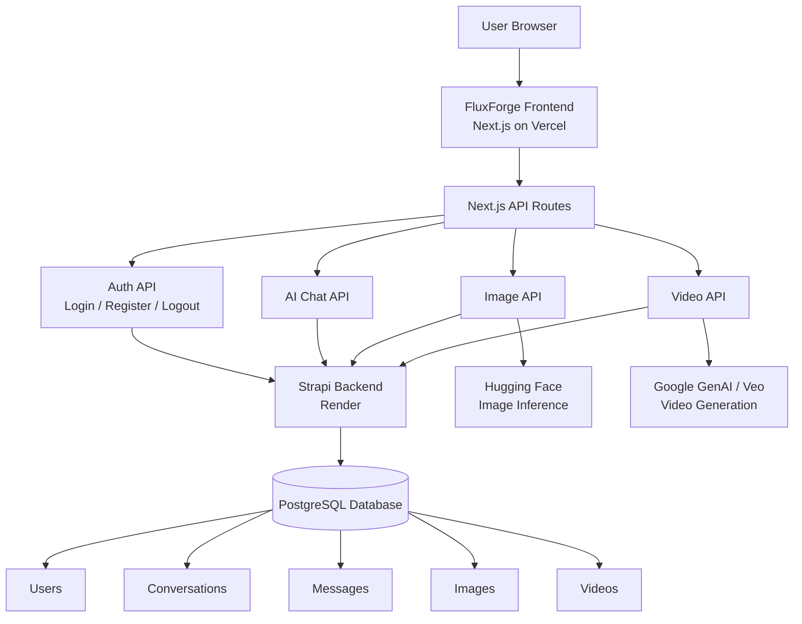

<div align="center">


<br />


<br />
<br />

<a href="https://fluxforge.vercel.app">
  
</a>
<a href="https://github.com/UjjwalKumarKannojiya/Ai-SaaS">
  
</a>


<br />
<br />


</div>

---

<div align="center">

## ✨ One Platform. Multiple AI Workflows. Production Architecture.

<table>
<tr>
<td align="center" width="25%">

<br />
<b>AI Chat</b>
<br />
<sub>Conversation workspace with stored chat history</sub>
</td>
<td align="center" width="25%">

<br />
<b>Image AI</b>
<br />
<sub>Prompt-to-image generation with saved gallery</sub>
</td>
<td align="center" width="25%">

<br />
<b>Video AI</b>
<br />
<sub>Google GenAI / Veo generation flow</sub>
</td>
<td align="center" width="25%">

<br />
<b>Code Assistant</b>
<br />
<sub>Developer productivity and code support</sub>
</td>
</tr>
</table>

</div>

---

## 🧠 What is FluxForge?

<table>
<tr>
<td width="60%">

**FluxForge** is a full-stack AI SaaS platform created to bring multiple AI tools into one clean, authenticated workspace.

It includes:

* Secure login and registration
* AI chat workspace
* AI image generation
* AI video generation workflow
* Code assistant
* Protected dashboard
* Strapi-powered backend
* PostgreSQL production database support
* Vercel + Render deployment setup

</td>
<td width="40%" align="center">


<br />


</td>
</tr>
</table>

---

## 🌐 Live Project

<div align="center">

| Platform            | URL                                                 |
| ------------------- | --------------------------------------------------- |
| 🚀 Live App         | **https://fluxforge.vercel.app**                    |
| 💻 Repository       | **https://github.com/UjjwalKumarKannojiya/Ai-SaaS** |
| ⚙️ Frontend Hosting | **Vercel**                                          |
| 🧩 Backend Hosting  | **Render**                                          |
| 🗄️ Database        | **PostgreSQL compatible**                           |

</div>

---

## 🧩 Feature Matrix

<table>
<tr>
<td width="50%">

### 🔐 Authentication

* Strapi users & permissions
* Register and login API routes
* JWT token flow
* HTTP-only auth cookie
* Protected dashboard layout
* Server-side user verification

</td>
<td width="50%">

### 🧠 AI Workspace

* AI chat route
* Conversation model
* Message model
* Assistant/user role storage
* Dashboard-first workflow
* Clean SaaS navigation

</td>
</tr>

<tr>
<td width="50%">

### 🖼️ Image Generation

* Hugging Face inference integration
* Prompt-based generation
* Generated image preview
* Saved image URL records
* Image gallery support
* Protected user access

</td>
<td width="50%">

### 🎬 Video Generation

* Google GenAI / Veo route
* Aspect ratio selection
* Duration selection
* Polling-based generation
* Vercel Hobby timeout compatible
* Billing-aware error handling

</td>
</tr>

<tr>
<td width="50%">

### 🧑‍💻 Code Assistant

* AI-powered code help
* Developer-friendly workspace
* Prompt-driven coding support
* Useful for snippets and debugging
* Integrated into SaaS dashboard

</td>
<td width="50%">

### 🚀 Production Deployment

* Frontend on Vercel
* Backend on Render
* PostgreSQL support
* Environment variable setup
* Deployment debugging completed
* Clean production architecture

</td>
</tr>
</table>

---

## 🛠️ Tech Stack

<div align="center">


<br />
<br />

<table>
<tr>
<th>Layer</th>
<th>Technology</th>
<th>Purpose</th>
</tr>
<tr>
<td><b>Frontend</b></td>
<td>Next.js 16, React 19, TypeScript</td>
<td>App Router, pages, API routes, server rendering</td>
</tr>
<tr>
<td><b>Styling</b></td>
<td>Tailwind CSS v4, shadcn/ui, Lucide React</td>
<td>Modern SaaS UI, responsive layouts, icons</td>
</tr>
<tr>
<td><b>Backend</b></td>
<td>Strapi 5</td>
<td>Auth, collections, content APIs</td>
</tr>
<tr>
<td><b>Database</b></td>
<td>PostgreSQL</td>
<td>Production-ready persistent storage</td>
</tr>
<tr>
<td><b>AI Image</b></td>
<td>Hugging Face Inference</td>
<td>Prompt-to-image generation</td>
</tr>
<tr>
<td><b>AI Video</b></td>
<td>Google GenAI / Veo</td>
<td>Prompt-to-video workflow</td>
</tr>
<tr>
<td><b>Deployment</b></td>
<td>Vercel + Render</td>
<td>Frontend and backend hosting</td>
</tr>
</table>

</div>

---

## 🧱 System Architecture

<div align="center">



</div>

---

## 📂 Repository Structure

```bash
Ai-SaaS/
│
├── frontend/
│   ├── app/
│   │   ├── api/
│   │   │   ├── auth/
│   │   │   │   ├── login/
│   │   │   │   ├── register/
│   │   │   │   └── logout/
│   │   │   ├── chat/
│   │   │   ├── image/
│   │   │   └── videos/
│   │   ├── dashboard/
│   │   ├── chat/
│   │   ├── image/
│   │   ├── video/
│   │   ├── code/
│   │   ├── login/
│   │   ├── register/
│   │   └── page.tsx
│   │
│   ├── components/
│   ├── lib/
│   ├── public/
│   ├── package.json
│   └── next.config.ts
│
├── strapi-ai-saas/
│   ├── config/
│   ├── database/
│   ├── src/
│   ├── package.json
│   └── .env.example
│
├── ClipForge/
├── README.md
└── SETUP_NOTES.md
```

---

## 🗺️ Application Routes

<table>
<tr>
<th>Route</th>
<th>Type</th>
<th>Description</th>
</tr>
<tr>
<td><code>/</code></td>
<td>Public</td>
<td>Animated landing page</td>
</tr>
<tr>
<td><code>/login</code></td>
<td>Public</td>
<td>User login page</td>
</tr>
<tr>
<td><code>/register</code></td>
<td>Public</td>
<td>User registration page</td>
</tr>
<tr>
<td><code>/dashboard</code></td>
<td>Protected</td>
<td>Main authenticated workspace</td>
</tr>
<tr>
<td><code>/chat</code></td>
<td>Protected</td>
<td>AI chat workspace</td>
</tr>
<tr>
<td><code>/image</code></td>
<td>Protected</td>
<td>Image generation page</td>
</tr>
<tr>
<td><code>/video</code></td>
<td>Protected</td>
<td>Video generation page</td>
</tr>
<tr>
<td><code>/code</code></td>
<td>Protected</td>
<td>Code assistant page</td>
</tr>
</table>

---

## 🔌 API Routes

<table>
<tr>
<th>API Route</th>
<th>Method</th>
<th>Purpose</th>
</tr>
<tr>
<td><code>/api/auth/register</code></td>
<td>POST</td>
<td>Create user account using Strapi</td>
</tr>
<tr>
<td><code>/api/auth/login</code></td>
<td>POST</td>
<td>Login user and set auth cookie</td>
</tr>
<tr>
<td><code>/api/auth/logout</code></td>
<td>POST</td>
<td>Clear auth cookie</td>
</tr>
<tr>
<td><code>/api/chat</code></td>
<td>POST</td>
<td>AI chat generation</td>
</tr>
<tr>
<td><code>/api/image</code></td>
<td>GET</td>
<td>Fetch saved image records</td>
</tr>
<tr>
<td><code>/api/image/generate</code></td>
<td>POST</td>
<td>Generate and save AI image</td>
</tr>
<tr>
<td><code>/api/videos</code></td>
<td>GET</td>
<td>Fetch saved video records</td>
</tr>
<tr>
<td><code>/api/videos/generate</code></td>
<td>POST</td>
<td>Generate and save AI video</td>
</tr>
</table>

---

## 🧬 Strapi Collections

<div align="center">

| Collection       | Main Fields                 | Purpose                 |
| ---------------- | --------------------------- | ----------------------- |
| **User**         | username, email, password   | Authentication          |
| **Conversation** | title                       | Chat sessions           |
| **Message**      | content, role, conversation | Chat history            |
| **Image**        | prompt, imageUrl            | Saved image generations |
| **Video**        | prompt, videoUrl            | Saved video generations |

</div>

---

## ⚙️ Environment Variables

<details open>
<summary><b>Frontend Environment — Vercel / Local</b></summary>

Create:

```bash
frontend/.env.local
```

```env
STRAPI_URL=http://localhost:1337
NEXT_PUBLIC_STRAPI_URL=http://localhost:1337

HUGGINGFACE_API_KEY=your_huggingface_token
GOOGLE_GENERATIVE_AI_API_KEY=your_google_generative_ai_key

NEXT_TELEMETRY_DISABLED=1
```

For Vercel production:

```env
STRAPI_URL=https://your-render-backend-url.onrender.com
NEXT_PUBLIC_STRAPI_URL=https://your-render-backend-url.onrender.com

HUGGINGFACE_API_KEY=your_huggingface_token
GOOGLE_GENERATIVE_AI_API_KEY=your_google_generative_ai_key

NEXT_TELEMETRY_DISABLED=1
```

</details>

<details open>
<summary><b>Backend Environment — Strapi / Render</b></summary>

Local development:

```env
HOST=0.0.0.0
PORT=1337
NODE_ENV=development

APP_KEYS=key1,key2,key3,key4
API_TOKEN_SALT=your_api_token_salt
ADMIN_JWT_SECRET=your_admin_jwt_secret
TRANSFER_TOKEN_SALT=your_transfer_token_salt
JWT_SECRET=your_jwt_secret

DATABASE_CLIENT=sqlite
DATABASE_FILENAME=.tmp/data.db
```

Production:

```env
NODE_ENV=production
HOST=0.0.0.0

DATABASE_CLIENT=postgres
DATABASE_URL=your_postgresql_database_url
DATABASE_SSL=true
DATABASE_SSL_REJECT_UNAUTHORIZED=false

APP_KEYS=key1,key2,key3,key4
API_TOKEN_SALT=your_api_token_salt
ADMIN_JWT_SECRET=your_admin_jwt_secret
TRANSFER_TOKEN_SALT=your_transfer_token_salt
JWT_SECRET=your_jwt_secret
```

</details>

---

## 🧑‍💻 Local Development

<details open>
<summary><b>Run Backend</b></summary>

```bash
cd strapi-ai-saas
npm install
npm run develop
```

Backend:

```bash
http://localhost:1337
```

Admin:

```bash
http://localhost:1337/admin
```

</details>

<details open>
<summary><b>Run Frontend</b></summary>

```bash
cd frontend
npm install
npm run dev
```

Frontend:

```bash
http://localhost:3000
```

</details>

---

## 🚀 Production Deployment

<table>
<tr>
<td width="50%">

### ▲ Vercel Frontend

```bash
Framework Preset: Next.js
Root Directory: frontend
Install Command: npm install
Build Command: npm run build
Output Directory: Default
Production Branch: main
```

</td>
<td width="50%">

### ⚙️ Render Backend

```bash
Root Directory: strapi-ai-saas
Build Command: npm install && npm run build
Start Command: npm run start
```

Important:

```bash
Do not use npm run develop in production.
```

</td>
</tr>
</table>

---

## 🧯 Production Debugging Timeline

<div align="center">

| Stage | Issue Faced                           | Fix Applied                                                   |
| ----- | ------------------------------------- | ------------------------------------------------------------- |
| 01    | Vercel showed `404`                   | Created clean Vercel project and used correct `frontend` root |
| 02    | Serverless `maxDuration` error        | Reduced video route duration for Vercel Hobby plan            |
| 03    | `/api/videos` build issue             | Split list route and generation route properly                |
| 04    | Strapi used `localhost` in production | Added `STRAPI_URL` and `NEXT_PUBLIC_STRAPI_URL` support       |
| 05    | Render used dev server                | Changed Render start command to `npm run start`               |
| 06    | PostgreSQL production support         | Added `pg` driver                                             |
| 07    | Login/Register 500 errors             | Connected frontend API routes with deployed Strapi backend    |
| 08    | Homepage looked basic                 | Rebuilt `/` as animated SaaS landing page                     |
| 09    | README was simple                     | Upgraded documentation with animated, structured sections     |

</div>

---

## ✅ SaaS Pre-Launch Checklist

<details>
<summary><b>Legal & Compliance</b></summary>

* [ ] Privacy Policy page
* [ ] Terms & Conditions page
* [ ] Cookie consent if targeting EU/GDPR users

</details>

<details>
<summary><b>Auth & Security</b></summary>

* [x] Signup/login flow
* [x] JWT auth
* [x] HTTP-only cookie
* [ ] Email verification
* [ ] Password reset
* [ ] OAuth login
* [ ] Rate limiting

</details>

<details>
<summary><b>AI & Usage</b></summary>

* [x] Image generation route
* [x] Video generation route
* [x] Chat route
* [ ] Usage credits
* [ ] Per-user rate limits
* [ ] Billing/subscription system

</details>

<details>
<summary><b>Deployment</b></summary>

* [x] Vercel frontend
* [x] Render backend setup
* [x] PostgreSQL-ready backend
* [x] Environment variable setup
* [ ] Monitoring
* [ ] Error tracking

</details>

---

## 🧭 Roadmap

<div align="center">

| Priority | Feature                          | Status      |
| -------- | -------------------------------- | ----------- |
| High     | Improve auth error handling      | In Progress |
| High     | Stabilize production backend     | In Progress |
| High     | Add usage credits                | Planned     |
| Medium   | Add Stripe subscriptions         | Planned     |
| Medium   | Add AI generation history search | Planned     |
| Medium   | Add admin analytics dashboard    | Planned     |
| Low      | Add team workspace support       | Future      |
| Low      | Add public prompt templates      | Future      |

</div>

---


---

## 🧠 What I Learned

* Building full-stack SaaS architecture
* Connecting Next.js API routes with Strapi
* Managing JWT authentication with cookies
* Handling production environment variables
* Deploying frontend and backend separately
* Debugging Vercel serverless limitations
* Solving Render Strapi deployment issues
* Integrating AI models into a real app
* Creating a scalable project structure
* Designing animated SaaS landing UI

---

## 👨‍💻 Author

<div align="center">


<br />
<br />

<b>Full-Stack Developer • MCA DS & AI Student • AI SaaS Builder</b>

<br />
<br />

<a href="https://github.com/UjjwalKumarKannojiya">
  
</a>
<a href="https://www.linkedin.com/in/ujjwal-kannojiya-78744723a/">
  
</a>

</div>

---

<div align="center">


<br />


</div>
