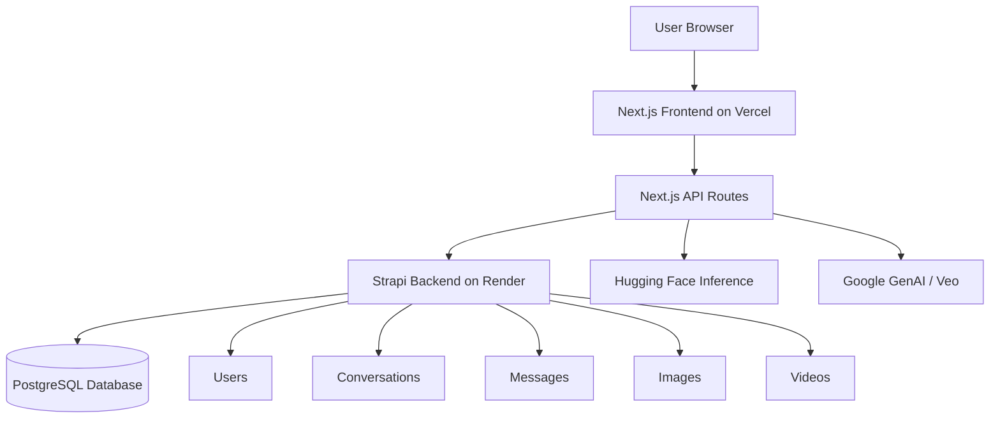

<div align="center">


<br />


<br />
<br />

<a href="https://fluxforge.vercel.app">
  
</a>
<a href="https://github.com/UjjwalKumarKannojiya/Ai-SaaS">
  
</a>


</div>

---

# 🚀 FluxForge — Full-Stack AI SaaS Platform

**FluxForge** is a modern full-stack AI SaaS platform built with **Next.js**, **React**, **Tailwind CSS**, **Strapi**, and multiple AI integrations. It provides a clean authenticated workspace where users can generate AI chat responses, images, videos, and coding assistance from one dashboard.

The project was built as a production-ready AI SaaS architecture with frontend deployment on **Vercel**, backend deployment on **Render**, and Strapi-powered content storage.

---

## 🌐 Live Links

| Type                 | Link                                            |
| -------------------- | ----------------------------------------------- |
| 🚀 Live Frontend     | https://fluxforge.vercel.app                    |
| 💻 GitHub Repository | https://github.com/UjjwalKumarKannojiya/Ai-SaaS |
| ⚙️ Backend Service   | Render Strapi backend                           |
| 🗄️ Database         | PostgreSQL / Render / Neon compatible           |

---

## ✨ Project Highlights

<div align="center">

| AI Chat                      | Image AI                   | Video AI                         | Code Assistant                |
| ---------------------------- | -------------------------- | -------------------------------- | ----------------------------- |
| Smart conversation workspace | Prompt-to-image generation | Google Veo video flow            | Developer-focused coding help |
| Saved conversations          | Saved generations          | Duration + aspect ratio controls | Useful for snippets and logic |
| Strapi storage               | Hugging Face model support | Billing-aware error handling     | Modern SaaS dashboard         |

</div>

---

## 🎯 Main Features

### 🔐 Authentication System

* User registration and login
* JWT-based authentication with Strapi
* Secure HTTP-only cookies
* Protected dashboard routes
* Auth state refresh and route protection

### 🤖 AI Chat Workspace

* Conversational AI interface
* User and assistant message roles
* Conversation storage through Strapi
* Clean dashboard UI

### 🖼️ AI Image Generation

* Prompt-based image generation
* Hugging Face inference integration
* Generated image preview
* Saved image records in Strapi
* Gallery support for previous generations

### 🎬 AI Video Generation

* Google GenAI / Veo workflow
* Aspect ratio options: `16:9`, `9:16`
* Duration options: `4s`, `6s`, `8s`
* Long-running API route support
* Vercel Hobby compatible timeout handling
* Billing error handling for Google Veo

### 💻 Code Assistant

* AI-assisted coding support
* Useful for snippets, debugging, and project planning
* Dashboard-based workflow

### 📊 Dashboard

* Protected workspace
* Sidebar navigation
* AI tool cards
* Modern dark SaaS UI
* Responsive layout

---

## 🧠 Tech Stack

<div align="center">


</div>

<br />

| Layer           | Technology                                         |
| --------------- | -------------------------------------------------- |
| Frontend        | Next.js 16, React 19, TypeScript                   |
| Styling         | Tailwind CSS v4, shadcn/ui, Lucide Icons           |
| Backend CMS     | Strapi 5                                           |
| Auth            | Strapi Users & Permissions, JWT, HTTP-only cookies |
| Database        | PostgreSQL                                         |
| AI Image        | Hugging Face Inference                             |
| AI Video        | Google GenAI / Veo                                 |
| Deployment      | Vercel + Render                                    |
| Package Manager | npm                                                |

---

## 🧩 Architecture



---

## 📁 Repository Structure

```bash
Ai-SaaS/
├── frontend/
│   ├── app/
│   │   ├── api/
│   │   │   ├── auth/
│   │   │   ├── chat/
│   │   │   ├── image/
│   │   │   └── videos/
│   │   ├── dashboard/
│   │   ├── login/
│   │   ├── register/
│   │   └── page.tsx
│   ├── components/
│   ├── lib/
│   ├── public/
│   ├── package.json
│   └── next.config.ts
│
├── strapi-ai-saas/
│   ├── config/
│   ├── src/
│   ├── database/
│   ├── package.json
│   └── .env.example
│
├── ClipForge/
├── README.md
└── SETUP_NOTES.md
```

---

## ⚙️ Environment Variables

### Frontend `.env.local`

Create this file inside:

```bash
frontend/.env.local
```

```env
STRAPI_URL=http://localhost:1337
NEXT_PUBLIC_STRAPI_URL=http://localhost:1337

HUGGINGFACE_API_KEY=your_huggingface_token
GOOGLE_GENERATIVE_AI_API_KEY=your_google_generative_ai_key

NEXT_TELEMETRY_DISABLED=1
```

For production on Vercel:

```env
STRAPI_URL=https://your-render-backend-url.onrender.com
NEXT_PUBLIC_STRAPI_URL=https://your-render-backend-url.onrender.com

HUGGINGFACE_API_KEY=your_huggingface_token
GOOGLE_GENERATIVE_AI_API_KEY=your_google_generative_ai_key

NEXT_TELEMETRY_DISABLED=1
```

---

### Backend `.env`

Create this file inside:

```bash
strapi-ai-saas/.env
```

```env
HOST=0.0.0.0
PORT=1337
NODE_ENV=development

APP_KEYS=key1,key2,key3,key4
API_TOKEN_SALT=your_api_token_salt
ADMIN_JWT_SECRET=your_admin_jwt_secret
TRANSFER_TOKEN_SALT=your_transfer_token_salt
JWT_SECRET=your_jwt_secret

DATABASE_CLIENT=sqlite
DATABASE_FILENAME=.tmp/data.db
```

For production PostgreSQL:

```env
NODE_ENV=production
HOST=0.0.0.0

DATABASE_CLIENT=postgres
DATABASE_URL=your_postgresql_database_url
DATABASE_SSL=true
DATABASE_SSL_REJECT_UNAUTHORIZED=false

APP_KEYS=key1,key2,key3,key4
API_TOKEN_SALT=your_api_token_salt
ADMIN_JWT_SECRET=your_admin_jwt_secret
TRANSFER_TOKEN_SALT=your_transfer_token_salt
JWT_SECRET=your_jwt_secret
```

---

## 🛠️ Local Setup

### 1. Clone the repository

```bash
git clone https://github.com/UjjwalKumarKannojiya/Ai-SaaS.git
cd Ai-SaaS
```

---

### 2. Start Strapi backend

```bash
cd strapi-ai-saas
npm install
npm run develop
```

Backend will run on:

```bash
http://localhost:1337
```

Strapi Admin:

```bash
http://localhost:1337/admin
```

---

### 3. Start Next.js frontend

Open a new terminal:

```bash
cd frontend
npm install
npm run dev
```

Frontend will run on:

```bash
http://localhost:3000
```

---

## 🚀 Deployment Guide

### Frontend Deployment — Vercel

Use these settings:

```bash
Framework Preset: Next.js
Root Directory: frontend
Install Command: npm install
Build Command: npm run build
Output Directory: Default
Production Branch: main
```

Required Vercel environment variables:

```env
STRAPI_URL=https://your-render-backend-url.onrender.com
NEXT_PUBLIC_STRAPI_URL=https://your-render-backend-url.onrender.com
HUGGINGFACE_API_KEY=your_huggingface_token
GOOGLE_GENERATIVE_AI_API_KEY=your_google_key
NEXT_TELEMETRY_DISABLED=1
```

---

### Backend Deployment — Render

Use these settings:

```bash
Root Directory: strapi-ai-saas
Build Command: npm install && npm run build
Start Command: npm run start
```

Important:

```bash
Do not use npm run develop in production.
```

Required Render environment variables:

```env
NODE_ENV=production
HOST=0.0.0.0

DATABASE_CLIENT=postgres
DATABASE_URL=your_postgres_connection_string
DATABASE_SSL=true
DATABASE_SSL_REJECT_UNAUTHORIZED=false

APP_KEYS=key1,key2,key3,key4
API_TOKEN_SALT=your_api_token_salt
ADMIN_JWT_SECRET=your_admin_jwt_secret
TRANSFER_TOKEN_SALT=your_transfer_token_salt
JWT_SECRET=your_jwt_secret
```

---

## 🔧 Important Fixes Completed During Deployment

This project went through real production debugging and deployment fixes:

| Issue                                    | Fix                                                                 |
| ---------------------------------------- | ------------------------------------------------------------------- |
| Vercel showing 404                       | Created clean Vercel project with correct `frontend` root directory |
| Vercel Hobby maxDuration error           | Reduced video API max duration to Hobby-compatible value            |
| `/api/videos` build issue                | Separated video list route from video generation route              |
| Strapi URL using localhost in production | Switched Strapi base URL to environment variables                   |
| Render running development server        | Changed production start command to `npm run start`                 |
| PostgreSQL production support            | Added `pg` driver for Strapi production database                    |
| Login/register 500 errors                | Connected frontend API routes to deployed Strapi backend            |
| Landing page looked basic                | Rebuilt `/` with polished animated SaaS landing page                |

---

## 🧪 API Route Overview

| Route                  | Purpose                      |
| ---------------------- | ---------------------------- |
| `/api/auth/register`   | Register user through Strapi |
| `/api/auth/login`      | Login user through Strapi    |
| `/api/auth/logout`     | Clear auth cookie            |
| `/api/chat`            | AI chat route                |
| `/api/image`           | List saved image records     |
| `/api/image/generate`  | Generate and save AI images  |
| `/api/videos`          | List saved video records     |
| `/api/videos/generate` | Generate and save AI videos  |

---

## 🧱 Strapi Collections

Recommended Strapi content types used by the app:

```bash
User
Conversation
Message
Image
Video
```

Example fields:

### Conversation

```bash
title: string
messages: relation
```

### Message

```bash
content: text
role: enum user | assistant
conversation: relation
```

### Image

```bash
prompt: text
imageUrl: string
```

### Video

```bash
prompt: text
videoUrl: string
```

---

## 🧑‍💻 UI Preview

<div align="center">


### Landing Page

Modern animated SaaS landing page with:

* Animated hero section
* Floating dashboard preview
* Gradient background
* Smooth hover cards
* Responsive CTA section

### Dashboard

Protected user workspace with:

* Chat
* Image generation
* Video generation
* Code assistant
* Saved records


</div>

---

## 🔐 Security Notes

* `.env` files are ignored and should never be committed.
* API keys must be stored only in Vercel/Render environment variables.
* JWT is stored in HTTP-only cookies.
* Strapi admin secrets must be generated securely.
* Production backend should always use PostgreSQL instead of local SQLite.

---

## 🧭 Roadmap

* [x] Next.js frontend setup
* [x] Strapi backend setup
* [x] Authentication flow
* [x] AI image generation
* [x] AI video generation route
* [x] Vercel deployment
* [x] Render deployment setup
* [x] Animated landing page
* [ ] User billing and subscription plans
* [ ] Usage limits per user
* [ ] Better analytics dashboard
* [ ] File upload support
* [ ] AI history search
* [ ] Admin monitoring panel
* [ ] Production logging and error tracking

---

## 🧠 Learning Outcomes

This project demonstrates:

* Full-stack SaaS architecture
* Next.js App Router API routes
* Secure auth with cookies
* Strapi CMS integration
* PostgreSQL production deployment
* AI API integration
* Vercel + Render deployment flow
* Debugging real production errors
* Environment variable management
* Modern SaaS UI/UX design

---

## 👨‍💻 Author

<div align="center">

### Ujjwal Kumar Kannojiya

Full-Stack Developer • MCA DS & AI Student • AI SaaS Builder

<a href="https://github.com/UjjwalKumarKannojiya">
  
</a>
<a href="https://www.linkedin.com/in/ujjwal-kannojiya-78744723a/">
  
</a>

</div>

---

<div align="center">


<br />


</div>
